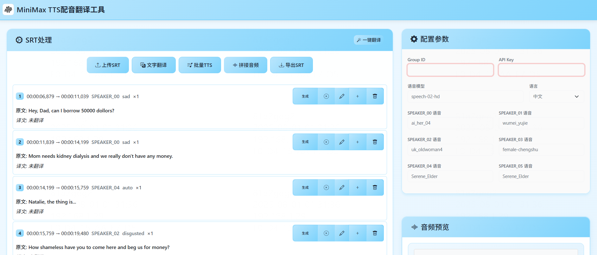

# 🎬 FastAPI 多人配音生成器

[](https://www.python.org/)
[](https://fastapi.tiangolo.com/)
[](https://opensource.org/licenses/MIT)

一个基于 FastAPI 的智能多人配音生成系统，支持字幕文件解析、角色语音分配、实时TTS生成和音频合成。

## ✨ 主要特性

### 🎯 核心功能
- **智能字幕解析**：支持 SRT 格式字幕文件，自动识别说话人和情绪
- **多人配音**：为不同角色分配不同的AI语音
- **实时TTS生成**：基于MiniMax API的高质量语音合成
- **音频时间轴同步**：精确的时间戳对齐和音频拼接
- **批量处理**：支持批量翻译和TTS生成
- **实时日志**：WebSocket实时日志显示，全程可监控

### 🌐 用户体验
- **现代化Web界面**：响应式设计，支持拖拽上传
- **实时进度显示**：处理进度实时更新
- **音频预览播放**：支持在线播放和下载
- **多语言支持**：25种语言的TTS支持
- **用户限流**：智能用户数量控制

### 🔧 管理功能
- **管理员面板**：实时监控系统状态和用户活动
- **资源监控**：CPU、内存、磁盘使用率监控
- **用户活动追踪**：API调用统计和用户行为分析
- **自动清理**：用户断开连接后自动清理相关文件

## 🖼️ 界面预览



*现代化的Web界面，支持字幕上传、实时配音生成和音频预览*

## 🚀 快速开始

### 环境要求

- Python 3.8+
- FFmpeg（用于音频处理）
- MiniMax API Key

### 一键启动

```bash
# 1. 克隆项目
git clone https://github.com/backearth1/MiniMax_TTS_Translation.git
cd MiniMax_TTS_Translation

# 2. 安装依赖
pip install -r requirements.txt

# 3. 启动服务（自动创建所需目录）
python3 main.py
```

### 访问服务

启动成功后，在浏览器访问：
- **主界面**: http://localhost:5215
- **API文档**: http://localhost:5215/docs  
- **管理面板**: http://localhost:5215/admin/dashboard

### 安装FFmpeg（可选）

如果需要高级音频处理功能：

```bash
# Ubuntu/Debian
sudo apt update && sudo apt install ffmpeg

# macOS
brew install ffmpeg

# Windows
# 请从 https://ffmpeg.org/download.html 下载并添加到PATH
```

### 配置设置

1. **获取MiniMax API Key**
   - 访问 [MiniMax开放平台](https://platform.minimaxi.com)
   - 注册账号并获取API密钥

2. **修改配置文件**（可选）
   ```python
   # config.py 中的主要配置项
   HOST = "0.0.0.0"          # 服务器地址
   PORT = 5215               # 服务器端口
   MAX_FILE_SIZE = 10485760  # 最大文件大小（10MB）
   ```

## 📖 使用指南

### 基础使用流程

1. **上传字幕文件**
   - 支持 `.srt` 格式的字幕文件
   - 文件大小限制：10MB
   - 自动识别字符编码（UTF-8/GBK）

2. **配置API参数**
   ```
   Group ID: 你的MiniMax Group ID
   API Key: 你的MiniMax API密钥
   模型选择: speech-01 或 speech-02-hd
   语言设置: 支持25种语言
   ```

3. **设置角色语音**
   - 为不同角色分配不同的AI语音
   - 支持多种语音风格和音色

4. **生成配音**
   - 点击"开始生成配音"
   - 实时查看处理进度和日志
   - 完成后可在线播放和下载

### 高级功能

#### 字幕编辑功能
- 主页面支持字幕内容修改和时间调整
- 支持在指定位置插入新段落
- 实时预览和批量操作

#### API接口使用
```python
import requests

# 上传字幕文件并生成配音
files = {'file': open('subtitle.srt', 'rb')}
data = {
    'groupId': 'your_group_id',
    'apiKey': 'your_api_key',
    'model': 'speech-02-hd',
    'language': 'Chinese',
    'voiceMapping': '{"角色1": "voice_id_1", "角色2": "voice_id_2"}',
    'clientId': 'your_client_id'
}

response = requests.post('http://localhost:5215/api/generate-audio', 
                        files=files, data=data)
```

## 🏗️ 项目架构

### 目录结构
```
fastapi-voice-generator/
├── main.py                 # FastAPI主应用
├── config.py              # 配置文件
├── requirements.txt       # 依赖列表
├── README.md             # 项目文档
├── audio_processor.py    # 音频处理核心
├── subtitle_manager.py   # 字幕管理模块
├── admin.py              # 管理员功能
├── utils/
│   └── logger.py         # WebSocket日志系统
├── static/               # 前端静态文件
│   ├── index.html       # 主页面
│   ├── css/
│   │   └── style.css    # 样式文件
│   └── js/
│       └── app.js       # 前端逻辑
├── outputs/              # 生成的音频文件
├── audio_files/          # 音频片段缓存
├── temp_audio/           # 临时音频文件
└── uploads/              # 上传文件缓存
```

### 技术栈
- **后端**：FastAPI, Python 3.8+, WebSocket
- **前端**：原生 JavaScript, Bootstrap 5, WebSocket
- **音频处理**：pydub, FFmpeg
- **TTS服务**：MiniMax API
- **系统监控**：psutil

## 🔧 API文档

### 主要接口

| 接口 | 方法 | 描述 |
|------|------|------|
| `/api/generate-audio` | POST | 生成配音音频 |
| `/api/parse-subtitle` | POST | 解析字幕文件 |
| `/api/subtitle/{id}/batch-translate` | POST | 批量翻译 |
| `/api/subtitle/{id}/batch-generate-tts` | POST | 批量TTS生成 |
| `/api/subtitle/{id}/merge-audio` | POST | 合并音频 |
| `/admin/dashboard` | GET | 管理员面板 |
| `/ws/{client_id}` | WebSocket | 实时日志连接 |

详细API文档请访问：http://localhost:5215/docs

## ⚙️ 配置说明

### 语音模型配置
```python
TTS_CONFIG = {
    "default_model": "speech-02-hd",
    "default_language": "Chinese",
    "supported_languages": [
        "Chinese", "English", "Japanese", "Korean", 
        "Arabic", "Spanish", "French", "Russian",
        # ... 更多语言
    ]
}
```

### 语音角色映射
```python
VOICE_MAPPING = {
    "旁白": "presenter_male",
    "男主": "audiobook_male_1", 
    "女主": "audiobook_female_2",
    # ... 自定义角色
}
```

## 🔒 安全特性

- **用户隔离**：每个用户的数据完全隔离
- **自动清理**：用户断开连接后自动清理临时文件
- **限流控制**：最大同时在线用户数限制
- **文件验证**：上传文件类型和大小验证
- **错误处理**：完善的异常捕获和处理

## 📊 性能优化

- **异步处理**：基于asyncio的高并发处理
- **内存管理**：智能的临时文件清理机制
- **批量操作**：支持批量翻译和TTS生成
- **缓存策略**：音频片段缓存和复用
- **进度追踪**：实时处理进度显示

## 🚀 部署建议

### Docker部署
```dockerfile
FROM python:3.9-slim

# 安装FFmpeg
RUN apt-get update && apt-get install -y ffmpeg

# 复制项目文件
COPY . /app
WORKDIR /app

# 安装依赖
RUN pip install -r requirements.txt

# 暴露端口
EXPOSE 5215

# 启动服务
CMD ["uvicorn", "main:app", "--host", "0.0.0.0", "--port", "5215"]
```

### Nginx配置
```nginx
server {
    listen 80;
    server_name your-domain.com;
    
    location / {
        proxy_pass http://127.0.0.1:5215;
        proxy_set_header Host $host;
        proxy_set_header X-Real-IP $remote_addr;
    }
    
    location /ws/ {
        proxy_pass http://127.0.0.1:5215;
        proxy_http_version 1.1;
        proxy_set_header Upgrade $http_upgrade;
        proxy_set_header Connection "upgrade";
    }
}
```

## 🤝 贡献指南

欢迎提交Issue和Pull Request！

1. Fork本项目
2. 创建feature分支 (`git checkout -b feature/AmazingFeature`)
3. 提交更改 (`git commit -m 'Add some AmazingFeature'`)
4. 推送到分支 (`git push origin feature/AmazingFeature`)
5. 创建Pull Request

## 📝 更新日志

### v1.0.0 (2024-07-29)
- ✨ 初始版本发布
- 🎯 支持SRT字幕解析和多人配音
- 🌐 现代化Web界面
- 📊 管理员面板和监控功能
- 🔧 自动文件清理机制

## 📄 开源协议

本项目采用 [MIT License](https://opensource.org/licenses/MIT) 开源协议。

## 🙏 致谢

- [FastAPI](https://fastapi.tiangolo.com/) - 现代化的Web框架
- [MiniMax](https://platform.minimaxi.com/) - 高质量TTS服务
- [pydub](https://github.com/jiaaro/pydub) - 音频处理库
- [Bootstrap](https://getbootstrap.com/) - 前端UI框架

## 📧 联系方式

如有问题或建议，请通过以下方式联系：

- GitHub Issues: [项目Issues页面](https://github.com/your-username/fastapi-voice-generator/issues)
- 邮箱: your-email@example.com

---

⭐ 如果这个项目对你有帮助，请给个Star支持一下！ 